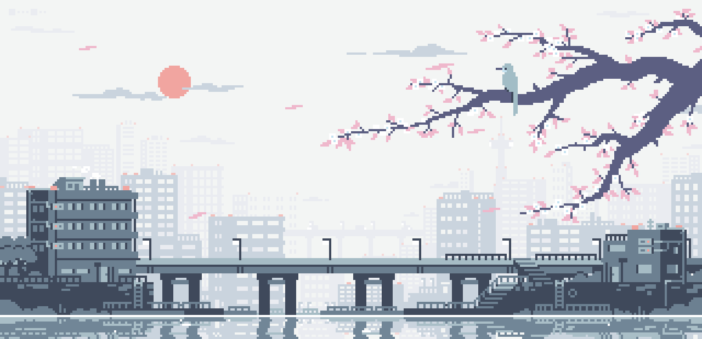

<!-- FIXED: Light mode compatible - uses semi-transparent backgrounds and borders -->

  <a href="https://anilist.co/anime/124080/Horimiya/" style="display: inline-block; background-color: rgba(13, 17, 23, 0.7); color: #F9A8D4; padding: 10px 20px; text-decoration: none; font-weight: bold; border-radius: 6px; border: 1px solid #F9A8D4;">✦ HORIMIYA</a>
  <a href="https://anilist.co/anime/20665/Shigatsu-wa-Kimi-no-Uso" style="display: inline-block; background-color: rgba(13, 17, 23, 0.7); color: #F9A8D4; padding: 10px 20px; text-decoration: none; font-weight: bold; border-radius: 6px; border: 1px solid #F9A8D4;">✦ YOUR LIE IN APRIL</a>

  <a href="https://anilist.co/anime/130003/Bocchi-the-Rock/" style="display: inline-block; background-color: rgba(13, 17, 23, 0.7); color: #F9A8D4; padding: 10px 20px; text-decoration: none; font-weight: bold; border-radius: 6px; border: 1px solid #F9A8D4;">✦ BOCCHI THE ROCK</a>
  <a href="https://anilist.co/anime/171627/Chainsaw-Man--The-Movie-Reze-Arc/" style="display: inline-block; background-color: rgba(13, 17, 23, 0.7); color: #F9A8D4; padding: 10px 20px; text-decoration: none; font-weight: bold; border-radius: 6px; border: 1px solid #F9A8D4;">✦ CHAINSAW MAN MOVIE</a>

  <a href="https://anilist.co/anime/99750/I-Want-to-Eat-Your-Pancreas/" style="display: inline-block; background-color: rgba(13, 17, 23, 0.7); color: #F9A8D4; padding: 10px 20px; text-decoration: none; font-weight: bold; border-radius: 6px; border: 1px solid #F9A8D4;">✦ I WANT TO EAT YOUR PANCREAS</a>

  <a href="https://anilist.co/anime/98659/Classroom-of-the-Elite/" style="display: inline-block; background-color: rgba(13, 17, 23, 0.7); color: #FCE7F3; padding: 10px 20px; text-decoration: none; font-weight: bold; border-radius: 6px; border: 1px solid #FCE7F3;">✦ CLASSROOM OF THE ELITE</a>
  <a href="https://anilist.co/anime/101922/Demon-Slayer-Kimetsu-no-Yaiba/" style="display: inline-block; background-color: rgba(13, 17, 23, 0.7); color: #FCE7F3; padding: 10px 20px; text-decoration: none; font-weight: bold; border-radius: 6px; border: 1px solid #FCE7F3;">✦ DEMON SLAYER</a>

 

<a href="https://anilist.co/user/Cognitiveshadows03/" style="display: inline-block; background-color: rgba(13, 17, 23, 0.7); color: #F9A8D4; padding: 10px 20px; text-decoration: none; font-weight: bold; border-radius: 6px; border: 1px solid #F9A8D4;">✦ VIEW FULL ANILIST</a>

  <a href="https://www.gsmarena.com/motorola_one_power-9431.php" style="display: inline-block; background-color: rgba(13, 17, 23, 0.7); color: #4ADE80; padding: 10px 15px; text-decoration: none; font-weight: bold; border-radius: 4px; border: 1px solid #4ADE80;">✦ MOTOROLA ONE</a>
  <a href="https://crdroid.net" style="display: inline-block; background-color: rgba(13, 17, 23, 0.7); color: #4ADE80; padding: 10px 15px; text-decoration: none; font-weight: bold; border-radius: 4px; border: 1px solid #4ADE80;">✦ CRDROID</a>
  <a href="https://kernelsu.org" style="display: inline-block; background-color: rgba(13, 17, 23, 0.7); color: #4ADE80; padding: 10px 15px; text-decoration: none; font-weight: bold; border-radius: 4px; border: 1px solid #4ADE80;">✦ KERNELSU</a>

  <a href="https://github.com/topjohnwu/Magisk" style="display: inline-block; background-color: rgba(13, 17, 23, 0.7); color: #FB923C; padding: 10px 15px; text-decoration: none; font-weight: bold; border-radius: 4px; border: 1px solid #FB923C;">MAGISK</a>
  <a href="https://twrp.me" style="display: inline-block; background-color: rgba(13, 17, 23, 0.7); color: #FB923C; padding: 10px 15px; text-decoration: none; font-weight: bold; border-radius: 4px; border: 1px solid #FB923C;">TWRP</a>
  <a href="https://developer.android.com/tools/adb" style="display: inline-block; background-color: rgba(13, 17, 23, 0.7); color: #FB923C; padding: 10px 15px; text-decoration: none; font-weight: bold; border-radius: 4px; border: 1px solid #FB923C;">ADB</a>
  <a href="https://source.android.com/docs/setup/test/running" style="display: inline-block; background-color: rgba(13, 17, 23, 0.7); color: #FB923C; padding: 10px 15px; text-decoration: none; font-weight: bold; border-radius: 4px; border: 1px solid #FB923C;">ANDROID TESTING</a>
  <a href="https://github.com/LSPosed/LSPosed" style="display: inline-block; background-color: rgba(13, 17, 23, 0.7); color: #FB923C; padding: 10px 15px; text-decoration: none; font-weight: bold; border-radius: 4px; border: 1px solid #FB923C;">LSPOSED</a>

  ✦ Hiragana - COMPLETE
  ✦ Katakana - IN PROGRESS
  ✦ Numbers - IN PROGRESS
  ✦ Particles - IN PROGRESS
  ✦ N5 Grammar - IN PROGRESS
  ✦ JLPT N5 - TARGET

>「いつか日本語を話せるようになりたい」

| | |
|:---:|:---:|
|  |

  <a href="https://www.instagram.com/7h3.qu13t.0n3?igsh=MXRiajN4cTlzMTg0MQ==" style="display: inline-block; background-color: rgba(13, 17, 23, 0.7); color: #F472B6; padding: 10px 15px; text-decoration: none; font-weight: bold; border-radius: 4px; border: 1px solid #F472B6;">✦ INSTAGRAM</a>
  <a href="https://t.me/Cognitiveshadows" style="display: inline-block; background-color: rgba(13, 17, 23, 0.7); color: #7DD3FC; padding: 10px 15px; text-decoration: none; font-weight: bold; border-radius: 4px; border: 1px solid #7DD3FC;">✦ TELEGRAM</a>
  <a href="mailto:sharppirate381@gmail.com" style="display: inline-block; background-color: rgba(13, 17, 23, 0.7); color: #FB923C; padding: 10px 15px; text-decoration: none; font-weight: bold; border-radius: 4px; border: 1px solid #FB923C;">✦ EMAIL</a>
  <a href="https://claude.ai" style="display: inline-block; background-color: rgba(13, 17, 23, 0.7); color: #C084FC; padding: 10px 15px; text-decoration: none; font-weight: bold; border-radius: 4px; border: 1px solid #C084FC;">✦ CLAUDE</a>
  <a href="https://www.deepseek.com/en/" style="display: inline-block; background-color: rgba(13, 17, 23, 0.7); color: #C084FC; padding: 10px 15px; text-decoration: none; font-weight: bold; border-radius: 4px; border: 1px solid #C084FC;">✦ DEEPSEEK</a>

 

<!-- FOOTER WAVE -->

